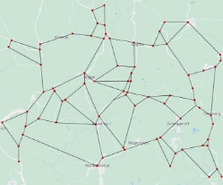
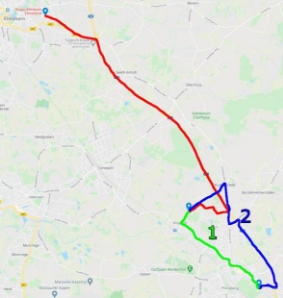

**Projekttitel: Unfallorganisierungsoptimierung** 

Teilnehmerin/Teilnehmer (mit Alter): Emil Wiards (15) 

Erarbeitungsort: Internatsgymnasium Stiftung Louisenlund Projektbetreuerin/Projektbetreuer: Martin Herbert Kaiser 

Thema des Projekts: Optimierung der Wege von Rettungswagen und Notzarzt Fachgebiet: Informatik 

Wettbewerbssparte: Jugend forscht 

Bundesland: Schleswig-Holstein 

Wettbewerbsjahr: 2021 

*Ihr könnt euer eigenes Deckblatt erstellen und es schön gestalten. Das Deckblatt zählt nicht zu den 15 Seiten. Ein Deckblatt wird später auch noch einmal automatisch von Jugend forscht er- stellt.* 

**Inhaltsverzeichnis** 

1. Kurzfassung .......................................................................................................................2 
1. Einleitung ...........................................................................................................................3 
1. Vorgehensweise, Materialien und Methode........................................................................3 
1. Ergebnisse   .......................................................................................................................4 
1. Ergebnisdiskussion   ..........................................................................................................4 
1. Zusammenfassung ............................................................................................................4 
1. Quellen- und Literaturverzeichnis  .....................................................................................4 
1. Anhang ..............................................................................................................................4 

**Kurzfassung** 

Der Grundgedanke jedes Rettungsvorgangs ist es Leben  zu  retten  und  der meines Projektes ihn zu optimieren, so dass  entscheidene Sekunden nicht fehlen. Dies passiert, indem die  Fahrrouten und Koordination zwischen Notarzt und Kranken- wagen optimiert werden.  

Dazu erhält  das  von mir erstellte Programm, um Wege  und  insbesondere Zeiten des Rettungsvorgangs zu optimieren, die  Position vom Unfall, dem nächsten Krankenhaus, dem Notarzt  *Abbildung 1: Bild eines Unfalls mit* und dem Rettungswagen. Das Programm zeigt dem Fahrer des  *Rettungskräften vor Ort* Rettungswagens und dem Notarzt die sinnvollsten Routen, um 

Wege und Zeit zu sparen und so Leben zu retten. 

Als erstes wird ein Gitter (engl. Grid) auf die passende Karte  gelegt (Abb. 2) und jeder Punkt dieses Grids entspricht einer  Möglichkeit des Fahrers seine Route zu ändern, also zum Bei- spiel eine Kreuzung. Jeder Strecke zwischen zwei aneinander  liegenden Punkten wird ein Zahlenwert zu geordnet, der die  Zeit diese Strecke zu absolvieren repräsentiert. Durch den hier  verwendeten Algorithmus wird dann der Weg, der die kürzeste   Zeit benötigt, zum Unfall für den Krankenwagen ermittelt. Zu- sätzlich eine Route für den Notarzt, um die am Unfall beteilig- ten Personen schnellstmöglich zu erreichen und professionelle  Hilfe leisten zu können.  

*Abbildung 2: Gitter auf einer Karte* 

**Einleitung** 

Als Beispiel möchte ich hier die Situation meines  Lehrers schildern. Sein Sohn hatte einen giftigen  Stoff zu sich genommen und daraufhin mussten  Rettungswagen und Notarzt kommen. Im konkre- ten  Fall  kam  der  Rettungswagen  von  einem  Krankenhaus östlich des Unfallortes und der Not- arzt von einem westlich. Der Rettungswagen kam  zuerst  an,  führte  eine  Erstversorgung  durch,  nahm den Patienten mit und fuhr zurück in Rich- tung des Krankenhauses. Zeitgleich fuhr der Not- arzt über eine Autobahn (rot), um dem Rettungs- wagen  auf  dem  Rückweg  ins  Krankenhaus  zu  begegnen und dem Patienten zu helfen. Der Ret- tungswagen hatte in diesem Fall zwei Routen zur  Auswahl, die beide trotz verschiedener Länge in  etwa die gleiche Fahrzeit benötigten, eine verläuft  weiter  südlich  (blau)  und  eine  weiter  nördlich  (grün). Die Autobahn, auf der der Notarzt kommt,  ist ebenfalls nördlich des Unfallortes, so dass der  Notarzt  schneller  zum  Rettungswagen  kommen  *Abbildung 1: Karte zum Beispiel im Text.* könnte, wenn der Fahrer sich für die blaue Stre-

cken entscheiden würde. In diesem Fall hat sich der Fahrer  für die grüne Route entschieden und somit ist der Notarzt erst  später zum Rettungswagen gestoßen. In diesem konkreten  Beispiel ist am Ende alles gut ausgegangen. Damit eine fal- sche  Entscheidung  der  Fahrer  nicht  zum  Verhängnis  des  Patienten  wird,  habe  ich  mich  dazu  entschieden,  ein  Pro- gramm zur Optimierung zu entwickeln, welches aufgrund von  Positions-  und  Verkehrsdaten  die  sinnvollsten  Routen  für  Rettungswagen und Notarzt ermittelt und somit Rettungszei- ten verkürzt.  

**Vorgehensweise, Materialien und Methoden**  

Zuerst  habe  ich  in  Python  ein  Straßennetz  in  Form  eines  Gitters  dargestellt,  dabei  stellen  die  Verbindungspunkte  Kreuzungen und die Verbindungen die Straßen dar. Mit Hilfe  eines  Zufallsgenerators  habe  ich  mögliche  Positionen  für  Unfallort und die Fahrzeuge generiert. Der ersten Algorith-

mus,  den  ich  im  Internet  gefunden  habe,  ist  der  A\*- *Abbildung 3: 10x10 Grid mit 3* Algorithmus.  Er  dient  der  Findung  des  schnellsten  Weges  *Objekten* 

zwischen  zwei  Punkten.  Das  macht  er,  indem  er  solange  über die Punkte mit der geringsten Summe des Abstandes  zwischen Endziel und Anfang geht, bis er den kürzesten Weg  findet. Diesen habe ich in mein Programm implementiert und  ihn den schnellsten Weg zwischen zwei der generierten Posi- tionen finden lassen.  

Es zeigte sich relative schnell, dass diese Vorgehensweise  sich nicht so einfach auf die Realität übertragen lässt. Nicht  jede Strecke zwischen zwei Punkten ist gleich lang und kann  auch bei gleicher Länge nicht immer gleich schnell befahren  werden. Daraufhin habe ich den Verbindungen zwischen den  einzelnen Punkten des Gitters eine Gewichtung in Form von  Zahlen von 1 bis 9 gegeben. Die Zahl 1 entspricht einer Zeit- einheit, die es dauert von einem bis zum anderen Gitterpunkt  zu gelangen, und 9 entspricht neun Zeiteinheiten, also 9-mal  so lang. Im Anschluss habe ich mich mehr über solche Algo- *Abbildung 4: A\*-Algorithmus vom* rithmen  informiert  und  bin  dabei  auf  den  Algorithmus  von  *Rettungswagen zum Unfall* 

Edsger Dijkstra gestoßen, dieser eignet sich sehr gut für mein  Vorhaben, da er von Grund auf von Verbindungen mit Ge- wichtungen  ausgeht  und  auch  auf  andere  Formen  als  ein  normales Gitter anwendbar ist. Bei Anwendung von Dijkstras  Algorithmus wird ein Startpunkt benötigt und heraus kommt  eine Liste mit der kürzesten Zeiten vom Startpunkt zu jedem  Punkt und dem Punkt über den man als letztes gegangen  sein muss, um die kürzeste Wegzeit zu erreichen.  

Zu Beginn setzt man die benötigten Zeiteinheiten zwischen  

dem Startpunkt und ihm selbst auf den Wert 0 und zu allen  

anderen Punkten auf unendlich. Nun Folgendes wird wieder- 

holt,  bis  alle  Punkte  besucht  worden  sind.  Zuerst  besucht  

man  den  unbesuchten  Punkt  mit  der  kleinsten  bekannten  

Wegzeit zum Startpunkt. Als Nächstes wird für alle verbun- 

denen Punkte die Wegzeit zum Startpunkt über den aktuellen  *Abbildung 5: Dijkstras Algorith-* Punkt berechnet und  falls diese  kürzer sein sollte, als die  *mus vom Rettungswagen zum* bisher bekannte, wird die Wegzeit und der Punkt, über den  *Unfall* 

man geht, um diese zu erreichen in der Liste aktualisiert. Die-

se Schritte werden dann wiederholt.** 

**Ergebnisse** 

Am Ende hatte ich ein Programm, welches ein Straßennetz mit zufällig generierten Zeiten, die es dauert, bestimmte “Straßen” entlang zu fahren. Ebenfalls werden die Positionen von zwei Kran- kenhäusern, eines mit Notarzt (N) und eines mit Rettungswagen (R), und die Position von einem Unfall generiert. Als nächstes wird die schnellste Wegzeit vom Krankenhaus mit Rettungswagen (R) und dem Unfall (U) ermittelt. Zusätzlich wird die Route des Notarztes zeitoptimiert damit er mit dem Rettungswagen beim Unfallort oder, wenn der Rettungswagen schon wieder auf dem Weg zum Krankenhaus ist, auf dem Rückweg des Rettungswagens. Dabei wird das schnelle Ankommen im Krankenhaus stärker gewichtet als das schnelle Erreichen des Notarztes des Ret- tungswagen. Jedoch wird eine Route für Rettungswagen und Notarzt ermittelt, die beides be- rücksichtigt. 

**Ergebnisdiskussion** 

Ich bin allgemein mit meinem Ergebnis zufrieden. Aber mir ist erst relativ spät aufgefallen, wie komplex das ganze System mit Rettungswagen und Notarzt ist. Mein Projekt deckt nur einen Teil der Fälle ab, die im wirklichen Leben passieren. Es gibt deutlich mehr Faktoren, die eigentlich mitberücksichtigt werden müssten. Weiter generiert sich das Programm seine Anwendungsfälle aktuell noch selbst und der nächste Schritt wäre es, echte Verkehrsdaten, dazu habe ich bei erster Recherche die API von[ here.com ](https://here.com/)gefunden, und echte Straßennetze in das Programm zu implementieren und sich das Programm solche auf Anfrage Selbst holen zu lassen. Ich denke, wenn man dem System die Möglichkeit gibt, mit echten Daten zu arbeiten und mehr Szenarien abdecken lässt, könnte dieses als zusätzliche Navigationsrichtline Rettungszeiten verkürzen. 

**Zusammenfassung** 

Die Aufgabe die Wege von Notärzten und Rettungswägen zu optimieren, um schneller Patienten helfen zu können ist theoretisch schon ganz gut, jedoch fehlt die Anwendbarkeit auf die Praxis. Ich denke das Programm ist ein erster Schritt, um die Koordination der unterschiedlichen Ret- tungskräfte zu verbessern. 

**Quellen- und Literaturverzeichnis [**https://www.youtube.com/watch?v=09_LlHjoEiY&t=5s ](https://www.youtube.com/watch?v=09_LlHjoEiY&t=5s)**(3.11.2020) [https://www.youtube.com/watch?v=-L-WgKMFuhE ](https://www.youtube.com/watch?v=-L-WgKMFuhE)(14.10.2020) [https://www.youtube.com/watch?v=ySN5Wnu88nE&t=191s ](https://www.youtube.com/watch?v=ySN5Wnu88nE&t=191s)(14.10.2020) [https://www.youtube.com/watch?v=pVfj6mxhdMw ](https://www.youtube.com/watch?v=pVfj6mxhdMw)(6.11.2020) [https://www.youtube.com/watch?v=GazC3A4OQTE ](https://www.youtube.com/watch?v=GazC3A4OQTE)(6.11.2020) 

**Anhang:[** https://github.com/AugmentedRe4lity/Unfallorganisierungsoptimierung** ](https://github.com/AugmentedRe4lity/Unfallorganisierungsoptimierung)**
Stand: 29.01.2021 **PAGE4/NUMPAGES4** 
